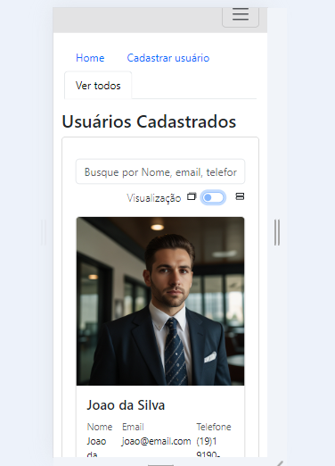
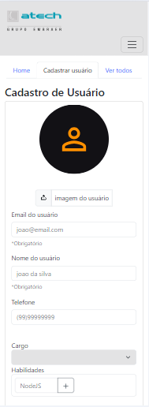
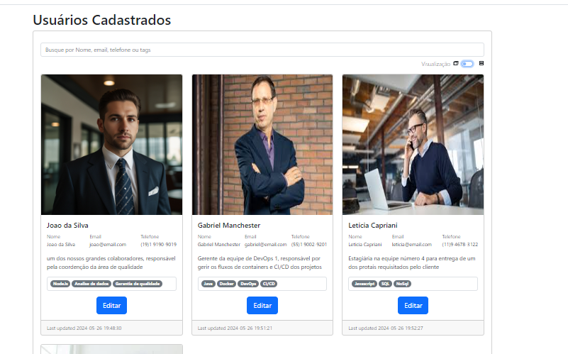
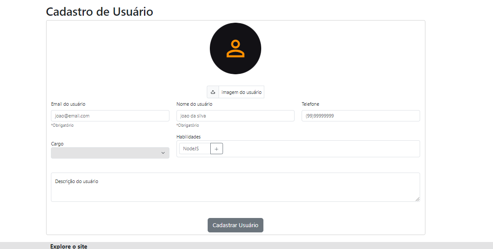

<h1 align="center">
      <a href="#" alt="Sestema CRUD Atech Tech">Atech CRUD Register Users</a>
</h1>
<h3 align="center">
    Um sistema CRUD para registro de usuários ficticios
</h3>
<p align="center">
  

  
  
  <a href="https://github.com/GustavoMolino59/API-FoodExplorer/commits/master">
    
  </a>
    
   
   
   
 <h4 align="center">
	🚧   Concluído 🚀 🚧
</h4>

Tabela de conteúdos
=================
<!--ts-->

* [Sobre o projeto](#sobre-o-projeto)
* [Funcionalidades](#Features)
* [Layout](#-layout)
     * [Mobile](#mobile)
     * [Web](#web)
* [Como executar o projeto](#Como-executar-o-projeto)
     * [Pré-requisitos](#pré-requisitos)
     * [Rodando a aplicação web (Servidor)](#user-content---rodando-o-back-end-servidor)
     * [Rodando a aplicação web (Front-End)](#user-content---rodando-o-front-end-servidor)
* [Documentação API](#-documentação-api)
* [Tecnologias](#-tecnologias)
* [Organização](#-organização)
* [Autor](#-autor)
<!--te-->

## 💻 Sobre o projeto
O projeto Foi desenvolvido para a vaga de desenvolvedor Júnior na Empresa Atech. No desafio foram solicitados três desafios, sendo um deles um Sistema CRUD com a finalizadade de cadastro de usuários. Para isso, criei um sistema FrontEnd e uma API Própria


### Funcionalidades
- [x] Cadastro de usuário
- [x] Edição de usuário
- [x] Remoção de usuário
- [x] Listagem de usuário
- [x] Pesquisa de usuário
- [x] Adição de Imagens de Avatar dos usuário

## 🎨 Layout

O Layout da aplicação é simples devido a ser uma aplicação com pouco tempo de desenvolvimento. Contudo, foram aplicads boas práticas de SEO e responsividade no que diz respeito ao desenvolvimento

### Mobile
<p align="center">
  

  
</p>

### Desktop
<p align="center">
  

  
</p>


### Como executar o projeto
### Pré-requisitos
Antes de começar, você vai precisar ter instalado em sua máquina as seguintes ferramentas:
[Git](https://git-scm.com), [Node.js](https://nodejs.org/en/). 
Além disto é bom ter um editor para trabalhar com o código como [VSCode](https://code.visualstudio.com/)

Garanta que não tem NENHUM OUTRO PROCESSO consumindo as portas locahost:5173 e localhost:3333. Pois são as portas que o server e o front estão preparados para emitir comunicação

### Clonando o projeto
```bash
# Clone este repositório
$ git clone <https://github.com/GustavoMolino59/API-FoodExplorer>

# Acesse a pasta do projeto no terminal/cmd
$ cd Atech-Register-Users-CRUD
```


### 🎲 Rodando o Back End (servidor)
```bash
# Vá para a pasta API
$ cd api

# Instale as dependências
$ npm install

# Execute a aplicação em modo de desenvolvimento
$ npm run dev

# O servidor inciará na porta:3333 - acesse <http://localhost:3333>
````

### 🎲 Rodando o Front End (web)
Agora com o Backend rodando, deixe-o rodando e vamos rodar nosso front-end

```bash
# Vá para a pasta web
$ cd web

# Instale as dependências
$ npm install

# Execute a aplicação em modo de desenvolvimento
$ npm run dev

# O servidor inciará na porta:5173 - acesse <http://localhost:5173>
````

Agora basta acessar no browser o endereço <http://localhost:5173> e você verá o sistema funcionando
## 🛠 Tecnologias

As seguintes ferramentas foram usadas na construção do projeto:

####**Server**  ([NodeJS](https://nodejs.org/en/) 

-   **[Express](https://expressjs.com/)**
-   **[CORS](https://expressjs.com/en/resources/middleware/cors.html)**
-   **[KnexJS](http://knexjs.org/)**
-   **[SQLite](https://github.com/mapbox/node-sqlite3)**
-   **[dotENV](https://github.com/motdotla/dotenv)**
-   **[Multer](https://github.com/expressjs/multer)**
> Veja o arquivo  [package.json](https://github.com/GustavoMolino59/Atech-Register-Users-CRUD/blob/main/package.json)


####**Web**  ([Vue 3](https://vuejs.org/)  +  [Bootstrap](https://getbootstrap.com/))
Com o servidor e front-end Funcionando, o sistema está pronto para ser usado. Basta acessar no seu navegador <http://localhost:5173>
-   **[Vue Router](https://router.vuejs.org/)**
-   **[PhosporIcons](https://phosphoricons.com/)**
-   **[Axios](https://github.com/axios/axios)**
-   HTML**
-   **[VueJs 3] (https://vuejs.org/)**
-   **[Vite] (https://vitejs.dev/)**

### Documentação API
<p align="center">
  <a href="assets/Insomnia-Atech" target="_blank"></a>
</p>

### Organização

#### **Backend**
O Backend e totalmente feito em NodeJs com apenas dois controllers, que garante o total funcionamento do sistema.
- UserController - Responsável por Criar, Buscar, Apresentar e Deletar tudo relacionado a usuários
- UserAvatarController - Responsável por gerenciar as imagens do servidor

Banco de dados - Utiliza-se um banco de dados SQLite que é inserido diretamente via Node com KNEXJs

#### **FrontEnd**
O FrontEnd e totalmente feito em VueJs com a extensa utilização do Bootstrap, que garante o total funcionamento do sistema e da responsividade.
Temos 5 pages
-Home
-Registro
-Edição
-Edição
-Listagem
-Sobre o site

A conexão com a API é inteiramente feita com o Axios
### Autor
---
Feito por Gustavo Molino 👋🏽 Entre em contato!

[](https://www.linkedin.com/in/gustavo-molino/)

[](mailto:g247144@dac.unicamp.br)


